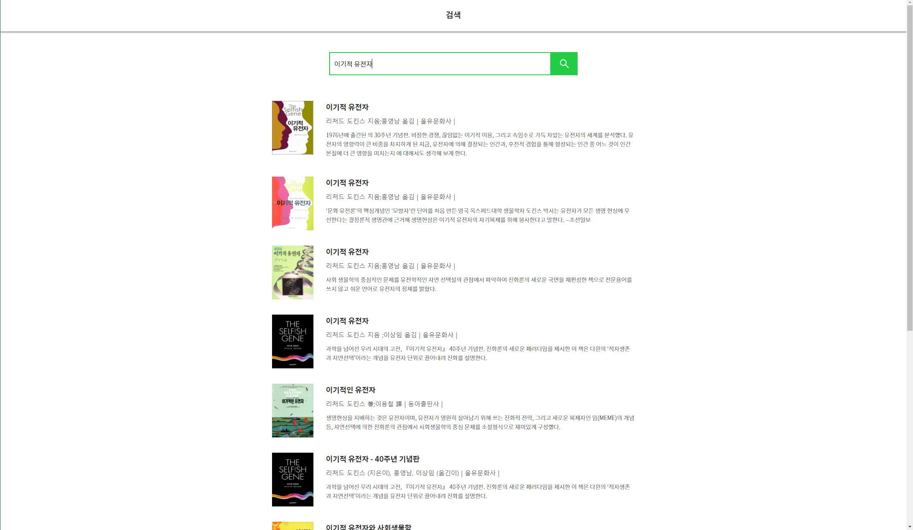
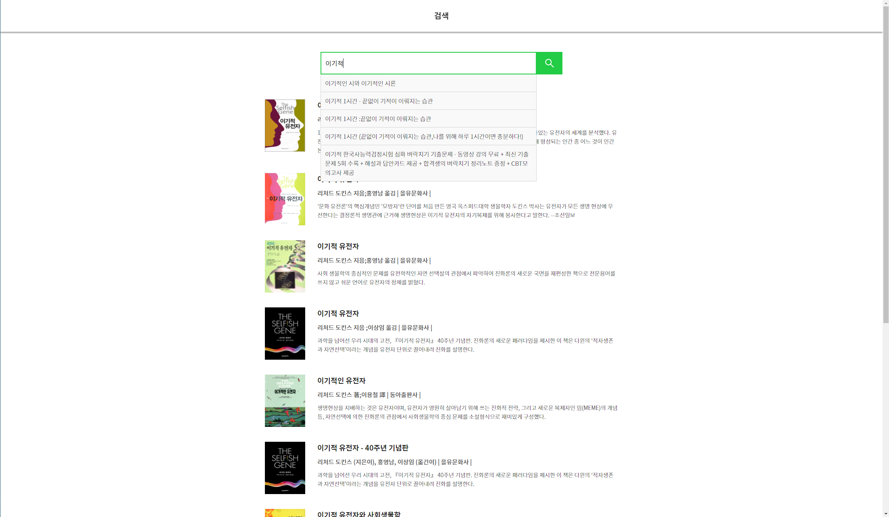
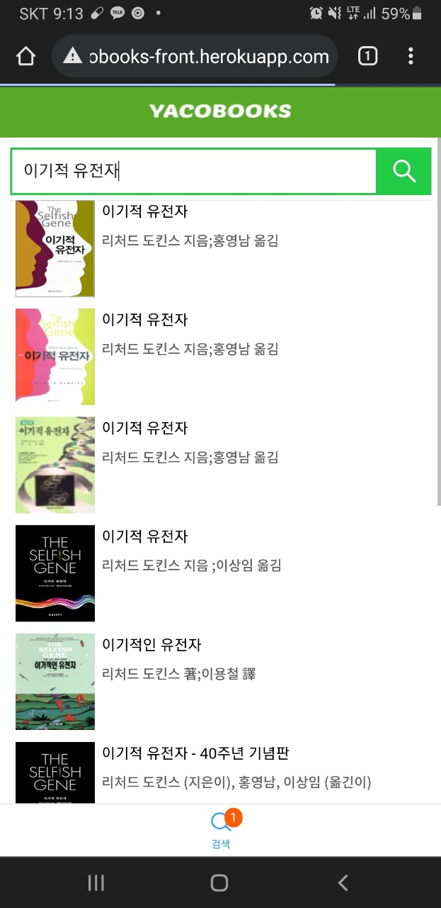
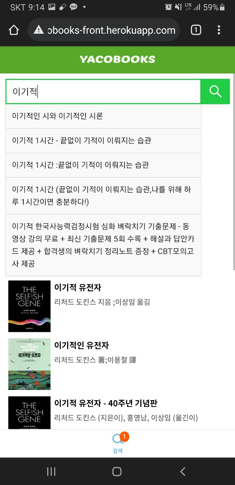

# 1. 소개

yacobooks front-end 프로젝트.

API 프로젝트 URL ↓

[https://github.com/yaincoding/yacobooks-api](https://github.com/yaincoding/yacobooks-api)

 

# 2. 화면

react-responsive를 사용하여 디바이스 화면 크기에 따라 View를 최적화하여 데스크탑/태블릿/모바일 각 기기에서 정상 동작하도록 설계

## a. 데스크탑 화면

## b. 모바일 화면

